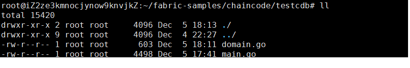
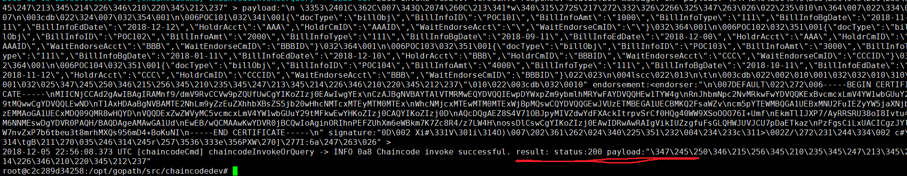
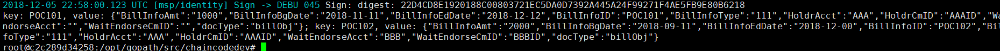

# testcdb

fabric网络尝试couchdb数据库查询功能！！！！！

### 说说链码测试:

#### 进入到fabric-sample，在chaincode文件加在新建一个文件夹（testcdb）将链码文件复制到testcdb：v




### 注意链码package 一定要依赖包以：main文件


## 正题：

跳转至 fabric-samples 的 chaincode-docker-devmode 目录：

```
$ cd ~/hyfa/fabric-samples/chaincode-docker-devmode/
```

启动网络

```
docker-compose -f docker-compose-simple.yaml up -d
```

上面的命令以 SingleSampleMSPSolo orderer配置文件启动网络，并以“dev模式”启 动对等体。它还启动了两个额外的容器 : 一个用于chaincode环境，一个用于与 chaincode交互的CLI。创建和加入通道的命令被嵌入到CLI容器中，因此可以立即 跳转到链式代码调用

终端2 建立并启动链码

打开第二个终端, 进入到 chaincode-docker-devmode 目录

```
$ cd ~/hyfa/fabric-samples/chaincode-docker-devmode/
```

进入

```
 sudo docker exec -it chaincode bash
```

编译 
进入testcdb目录编译chaincode

```
root@iZ2ze3kmnocjynow9knvjkZ:/opt/gopath/src/chaincode#  cd testcdb

root@iZ2ze3kmnocjynow9knvjkZ:/opt/gopath/src/chaincode/testcdb#  go build
```

运行chaincod

```
CORE_PEER_ADDRESS=peer:7052 CORE_CHAINCODE_ID_NAME=cdb:0 ./testcdb
```

终端3 使用链码 

```
 sudo docker exec -it cli bash
```

安装及实例化

进入CLI容器后执行如下命令安装及实例化chaincode

```
peer chaincode install -p chaincodedev/chaincode/testcdb -n cdb -v 0

peer chaincode instantiate -n(链码ID) cdb -v 0 -c '{"Args":["init"]}' -C（通道ID） myc
```

调用

```
peer chaincode invoke -n cdb -c '{"Args":["billInit"]}' -C myc
```



```
peer chaincode query -n cdb -c '{"Args":["queryBills", AAAID"]}' -C myc
```



```
peer chaincode query -n cdb -c '{"Args":["queryWaitBills", BBBID"]}' -C myc
```

